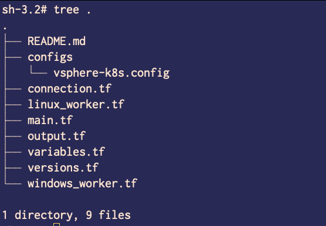

# Deploying Virtual Machines to install Kubernetes Cluster in HA mode

This terraform code launches VM on vSphere with provided details. 

## Code Base

The code is written in 3 modules with bare minimal option to launch VMs on the vSphere.

- **module k8s-controller :** This module lives in `main.tf` file. Create controller VMs with the desired OS template.

- **module k8s-linux-workers :** This module lives in `linux_worker.tf` file. Create Linux worker VMs.

- **module k8s-windows-worker :** This module lives in `windows_worker.tf` file. Create Windows worker VMs.


- **Terraform Version**: We used latest release as of this date `1.0.1`.

- **Provider**:  Using *"hashicorp/vsphere"* with version `2.0.2`.

```bash
terraform {
  required_providers {
    vsphere = {
      source = "hashicorp/vsphere"
      version = "2.0.2"
    }
  }
}
```


- Here is the snippet of the file structure:



## Process: 

### Step #1: Launch VMs

- Clone the repo:  

```bash
git clone git@github.com:prodapt-cloud/k8sonvmware-terraform.git
```


- If you are using windows workstation below is the command to git clone:

```bash
git clone git@github.com:prodapt-cloud/k8sonvmware-terraform.git --config core.sshCommand="ssh -i ~/.ssh/prodapt-git"
```
- Provide the required actual values in `configs/vsphere-k8s.config` file. 

> Note: The `configs/vsphere-k8s.config` file must be in `.gitignore` file. In no circuimstances, it should be checked in to repo.

- Run `terraform init`

- Run `terraform plan -var-file=configs/vsphere-k8s.config` to see the plan. Fix any missing details.

- If you want to generate any output values, put those in `output.tf` file.


- Run `terraform apply -var-file=configs/vsphere-k8s.config` and approve the execution.

### Step #2: Install Kubernetes packages with Ansible or Terraform Provisioner

<< TBD >>


### Step #3: Integrate with CI/CD (GitOps)

<< TBD >>

## Reference

- https://registry.terraform.io/providers/hashicorp/vsphere/latest


- https://github.com/Terraform-VMWare-Modules/terraform-vsphere-vm